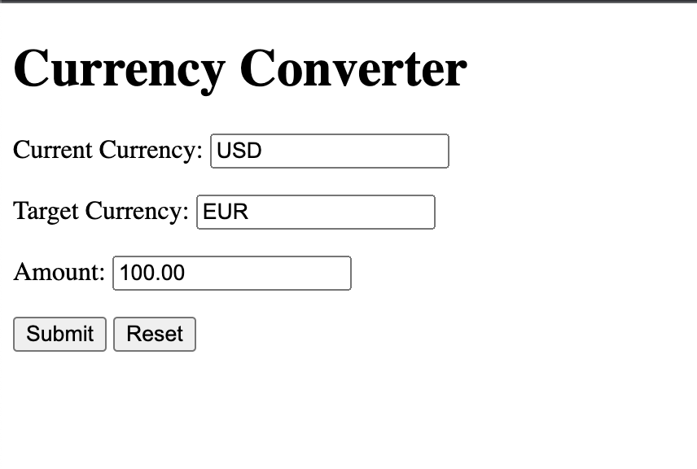
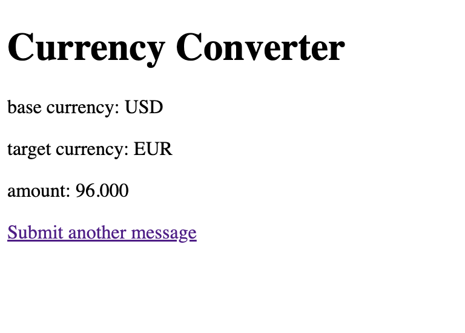

# currency-converter

This is a simple application that converts currencies.

*Given* the current exchange rate for USD to EUR is 0.96 \
*When* the user enters 100 for the amount  \
*Then* &euro;96 is returned

